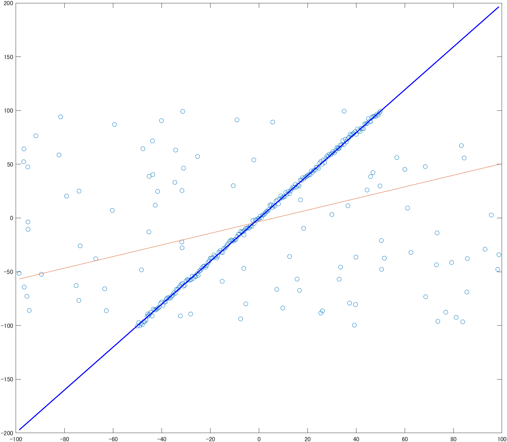
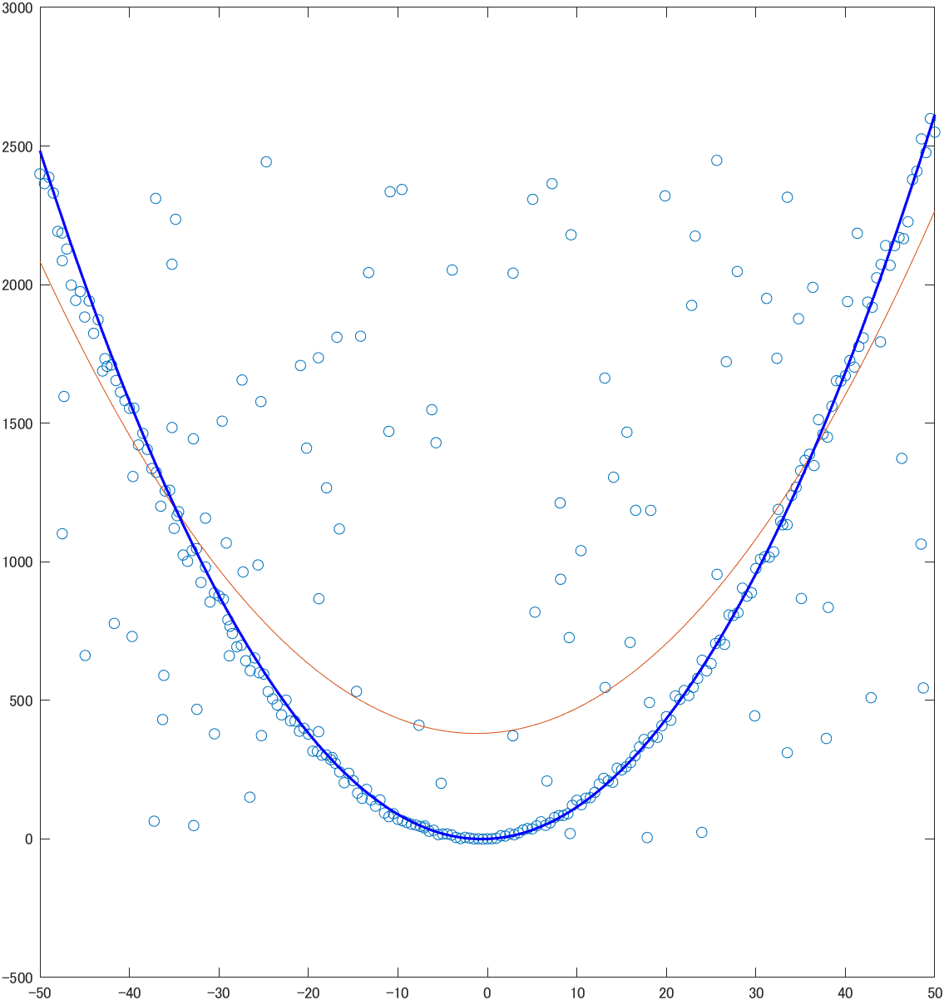

# RANSAC
Fit model to noisy data

# Syntax
```matlab
[model] = mlesac(data,fitFcn,distFcn,sampleSize,maxDistance)
```

# Description
``` [model] = mlesac(data,fitFcn,distFcn,sampleSize,maxDistance) ``` fits a model to noisy data using the random sample consensus (RANSAC) algorithm.

# Examples
```matlab
%% Init data
x = -50:0.5:50;
y = zeros(1, length(x));
for i = 1:length(x)
    x_tmp = x(i) + 2*(rand() - 0.5);
    y(i) = 2*x_tmp + 3*(rand() - 0.5);
end

for i = 1:100
    x(end+1) = (rand() - 0.5)*200;
    y(end+1) = (rand() - 0.5)*200;
end

%% test
p = polyfit(x,y,1);
y_1 = polyval(p,x);

fitLineFcn = @(points) polyfit(points(:,1),points(:,2),1);
evalLineFcn = @(model, points) sum((points(:, 2) - polyval(model, points(:,1))).^2,2);
p = mlesac([x', y'], fitLineFcn, evalLineFcn, 2, 20);
y_2 = polyval(p,x);

figure(1);
plot(x, y, 'o');
hold on;
plot(x, y_1);
plot(x, y_2, 'LineWidth', 1.5, 'Color', 'b');
hold off;
```


```matlab
%% Init data
x = -50:0.5:50;
y = zeros(1, length(x));
for i = 1:length(x)
    x_tmp = x(i) + 2*(rand() - 0.5);
    y(i) = x_tmp*x_tmp + 2*x_tmp + 3*(rand() - 0.5);
end

for i = 1:100
    x(end+1) = (rand()-0.5)*100;
    y(end+1) = (rand())*2500;
end

%% test
p = polyfit(x,y, 2);
y_1 = polyval(p, [-50:50]);

fitLineFcn = @(points) polyfit(points(:,1),points(:,2), 2);
evalLineFcn = @(model, points) sum((points(:, 2) - polyval(model, points(:,1))).^2,2);
p = mlesac([x', y'], fitLineFcn, evalLineFcn, 2, 20);
y_2 = polyval(p, [-50:50]);

figure(2);
plot(x, y, 'o');
hold on;
plot([-50:50], y_1);
plot([-50:50], y_2, 'LineWidth', 1.5, 'Color', 'b');
hold off;
```


# References
・https://www.mathworks.com/help/vision/ref/ransac.html#bvhr3vi-fitFcn